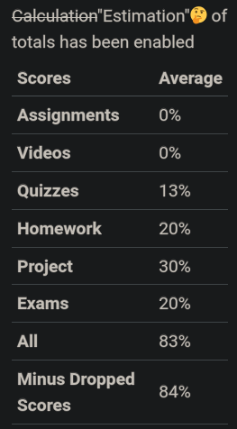

# ASU Grades Estimator

## Purpose

Some professors disable grade calculations in their courses because canvas doesn't always calculate grades correctly. This script tries to estimate what your current grade is and then replaces the calculation disable message.

## Example

| Before                  | After                 |
| ----------------------- | --------------------- |
|  |  |

## How to use it

### Via Install (Preferred)

- [Firefox](https://addons.mozilla.org/firefox/downloads/file/4311410/5224a0b9645549d688d8-1.0.0.xpi).
- [Chrome](https://chromewebstore.google.com/detail/eknlkibmcjeclllpgmkoopbhlhmhikfk?utm_source=item-share-cp)

### Via Browser Console (Hacky Workaround)

1. Navigate to the grades screen in canvas. The link should look something like `https://canvas.asu.edu/courses/<course-id>/grades`.
2. Press F-12 to bring up the dev tools.
3. Navigate to the console tab.
4. Paste the code block below into the console.
5. Type "allow pasting" or whatever the console tells you to do.

- Note: Be careful just pasting random scripts into dev tools. Someone could steal your bank info that way. I'm not going to, but someone could.

### Code Block to Paste

```javascript:getGrades.js
// Just nav the grades page hit f-12 and paste this into the dev console
function removeZeroPointRows() {
  const allPossibleGradeSpans = [...document.querySelectorAll(".student_assignment .assignment_score .tooltip .grade+span")]
  const zeroPointSpans = allPossibleGradeSpans.filter(el => parseInt(el.textContent.replace("/", "")) === 0)
  const zeroPointRows = zeroPointSpans.map(el => el.parentElement.parentElement.parentElement.parentElement)
  zeroPointRows.forEach(row => row.remove())
}
function getGradedRows() {
  return [...document.getElementsByClassName("student_assignment assignment_graded")]
}
function elToAssignmentObject(el) {
  return {
    groupType: el.querySelector("th > .context").textContent,
    actualScore: parseFloat(el.querySelector("td.assignment_score div.score_holder span.tooltip span.grade").innerText.replace(/^.*\n/, "")),
    possibleScore: parseFloat(el.querySelector(" td.assignment_score div.score_holder span.tooltip >span.grade+span").innerText.replace(/^\//, "")),
  }
}
function getGroups() {
  return [...document.querySelectorAll("div#assignments-not-weighted div table.summary tbody tr")].map(el => ({ group: el.querySelector("th").textContent, weight: parseInt(el.querySelector("td").textContent.replace("%", "")) })).filter((el) => el.group != "Total");
}
function getScale(groupType) {
  return getGroups().find(el => el.group === groupType).weight;
}
console.log({ groups: getGroups(), assignments: getGradedRows().map(elToAssignmentObject) })
function getAverage(assignments) {
  const groups = getGroups()
  const averages = groups.map(el => weightedAverageForGroup(assignments, el.group))
  return averages.reduce(toTotal, 0)
  function toTotal(total, current) {
    return total += current
  }
}
function weightedAverageForGroup(assignments, group) {
  const filteredGroup = assignments.filter(el => el.groupType === group)
  const total = filteredGroup.reduce((result, curr) => result += curr.actualScore / curr.possibleScore, 0)
  // if category has no entries set the average to one for max points
  const average = total / filteredGroup.length || 1;
  const weightedAverage = average * getScale(group)
  return weightedAverage
}
function replaceDisabledMsg() {
  const msgBox = document.querySelector("#student-grades-final");
  msgBox.innerHTML = `<s>Calculation</s>"Estimation"🤔 of totals has been enabled\n`
  const allAssignments = getGradedRows().map(elToAssignmentObject)
  const nonDroppedAssignments = getGradedRows()
    .filter((el) => !el.classList.contains("dropped"))
    .map(elToAssignmentObject)
  msgBox.innerHTML += `<table class="summary">
    <thead>
    <tr>
      <th scope="col">Scores</th>
      <th scope="col">Average</th>
    </tr>
    </thead>
    <tbody>
${getGroups().map(({ group }) => {
    return `<tr>
              <th scope="row">${group}</th>
              <td>${Math.floor(weightedAverageForGroup(allAssignments, group))}%</td>
            </tr>`
  }).join("")}
        <tr>
          <th scope="row">All</th>
          <td>${Math.floor(getAverage(allAssignments))}%</td>
        </tr>
        <tr>
          <th scope="row">Minus Dropped Scores</th>
          <td>${Math.floor(getAverage(nonDroppedAssignments))}%</td>
        </tr>
    </tbody>
  </table>`
}
removeZeroPointRows()
replaceDisabledMsg()

```
